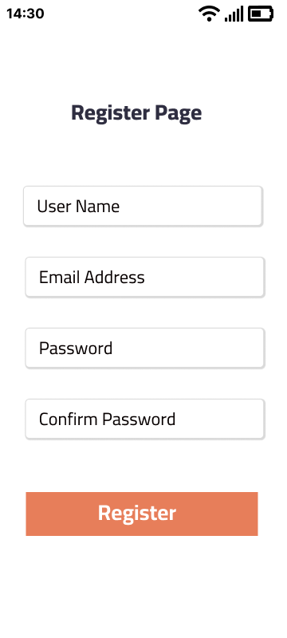
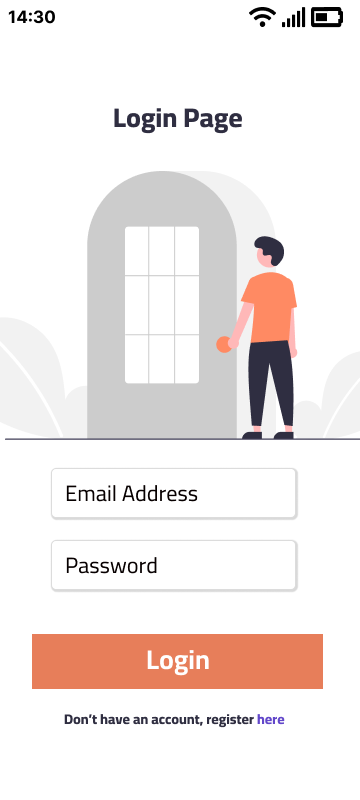

## About

This project is developed by a team of GADS (Google Africa Developer Scholarship) learners and mentors as requirement for the project phase of the learning.

The *iGymHealth* app inspiration is physical and mental fitness.

The developers team seek to contribute to mental and physical well being of the app users by providing self guides that include phyical exercises, dieting tips and options, as well as mental wellness inspirations.

It is our hope that through the app, many shall get inspiration and guidance on physical and mental wellness.

## Features
* Physical strength exercises
* Relaxation exercises
* Mental wellness inspiration quotes
* In the future we hope to integrate the app to Google Smart watch and Google Fit Products

## Tools
* Android Studio
* Kotlin
* Figma
* Adobe XD

## Read The Docs

[Navigation](docs/navigation.md)
[Design](docs/main.md)

## How to install

## Preview

  Welcome                |    Register        | Login
:-------------------------:|:-------------------------:|:----------------------
||

## Contribution

Contribution to this project is limited to GADS Health-team 16 [members](CONTRIBUTING.md). After clonining the repo, create a different branch to develop in, you must create pull request to that specific branch to get it merged to main.

## Support

