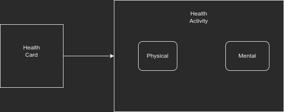

# App Navigation.md

The app structure is split into different parts in order to make it easier to work with.

## Layout

The app uses bottom bar navigation for the main UI.
On the Home screen when the user clicks any of the cards. They are taken to a tab navigation UI.
In that tab navigation UI there are fragments for that specific activity.

## The Navigation

The user can click any of the cards within the Home Fragment/Screen.
The app will take the user to the relevant screen and run the activity called.
In order for the user to return to the home screen they have to use the back button.
This will be fixed in the future versions with deep linking, to allow the user to
navigate to anywhere within the app from any point.

An example of the navigation can be seen in the diagram below.

